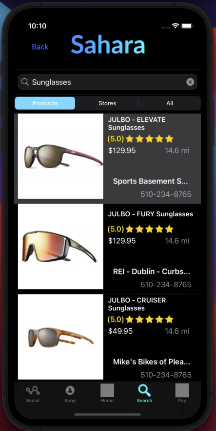

# Sahara iOS App

Welcome to **Sahara**, the iOS application designed to empower users to explore products available in their local mom and pop stores, offering a refreshing alternative to mainstream retail chains. By leveraging the SwiftSoup library, the app scours local websites to extract product information, ensuring you have access to unique, community-based offerings.




## Features

### Home Page
Discover trendy items and local businesses that offer a diverse array of products. Immerse yourself in the distinctive offerings that local vendors bring to your neighborhood.

### Search Page
Looking for something specific? Use our powerful search functionality to find products from local stores. Simply enter the product name, and the app will display a list of matching items along with store information.

### Payment Page
Support local store owners directly by making payments through the app. We offer payment options through PayPal and Bitcoin, ensuring a seamless transaction process.

### Profile Page
Create a profile to make the most out of your Sahara experience. Leave reviews for your favorite products and stores, helping others discover hidden gems. You can also list your own items for sale, turning the app into a peer-to-peer marketplace.

### Future Feature: Instant Messaging
Stay connected with local store owners and fellow shoppers through instant messaging. Whether you have questions about a product or want to negotiate a deal, our messaging feature will facilitate seamless communication.

## Web Scraping Code Snippet

Below is a snippet of the Swift code used to scrape data from local store websites using the SwiftSoup library:

```swift
func doAthing(_ searchBar: UISearchBar) {
    // Set up an alert with a loading indicator
    let alert = UIAlertController(title: nil, message: "Please wait...", preferredStyle: .alert)
    let loadingIndicator = UIActivityIndicatorView(frame: CGRect(x: 10, y: 5, width: 50, height: 50))
    loadingIndicator.hidesWhenStopped = true
    loadingIndicator.style = UIActivityIndicatorView.Style.medium
    loadingIndicator.startAnimating()
    alert.view.addSubview(loadingIndicator)
    present(alert, animated: true, completion: nil)

    // Construct the URL based on the search text
    guard let searchText = searchBar.text, let url = URL(string: "https://www.locally.com/search/all/activities/depts?q=" + searchText) else {
        return
    }

    do {
        // Fetch the HTML content from the URL
        let html = try String(contentsOf: url)
        let doc = try SwiftSoup.parse(html)

        // Extract elements from the HTML
        guard let titles = try? doc.getElementsByClass("product-thumb "),
              let prices = try? doc.getElementsByClass("product-thumb-price dl-price"),
              let stores = try? doc.getElementsByClass("filter-label-link"),
              let images = try? doc.getElementsByClass("product-thumb-img") else {
            return
        }

        // Clear existing arrays before populating with new data
        products = []
        miles = []
        dollars = []
        names = []
        images = []
        stars = []

        // Iterate through product elements and extract details
        for title in titles.array() {
            // ... Extract product details ...

            // Check if product URL can be constructed from href
            if let href = try? title.attr("href"), let productURL = URL(string: "https://www.locally.com/" + href) {
                // Fetch additional data from the product's individual page
                let html1 = try String(contentsOf: productURL)
                // ... Extract distances, categories, descriptions, ratings, and more ...

                // Append extracted data to respective arrays
                products.append(productName)
                miles.append(distance)
                // ... Append other data ...
            }
        }

        // Dismiss the loading indicator
        alert.dismiss(animated: true, completion: nil)
    } catch {
        // Handle errors here
        print("Error: \(error)")
        alert.dismiss(animated: true, completion: nil)
    }
}

```

#Installation
1. Clone this repository to your local machine.
   `git clone https://github.com/Maaz0070/Sahara_iOS.git`
2. Open the project in Xcode.
3. Build and run the app on your simulator or device

#Feedback and Contributions
We're excited to bring you Sahara and we welcome your feedback and contributions. If you encounter any issues or have suggestions for improvements, please don't hesitate to open an issue on our GitHub repository.

Happy local shopping! 🛍️
